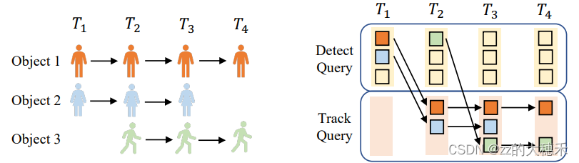
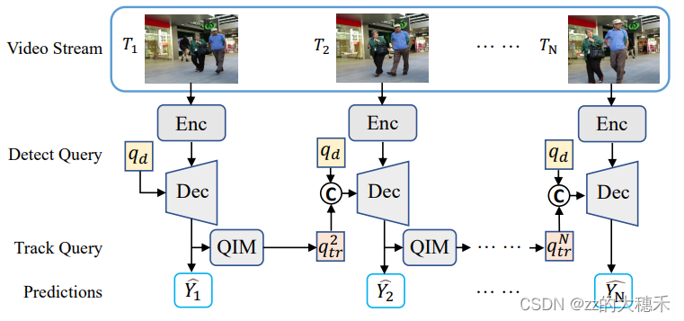

# Autonomous_driving
用于记录自动驾驶学习期间的各种知识，以及一些自动驾驶相关的内容。

## 一、UniAD:Planning-oriented Autonomous Driving
｜[代码](https://github.com/OpenDriveLab/UniAD)｜[论文](https://openaccess.thecvf.com/content/CVPR2023/papers/Hu_Planning-Oriented_Autonomous_Driving_CVPR_2023_paper.pdf)｜2023年 CVPR 上交大|

**论文主要创新点**：

  

  该论文主要将自动驾驶模型中的感知、预测、规划等不同阶段融合到了一个pipeline中，论文中说这样可以减少错误的累计，**个人理解**这样确实会减少错误的累积，但是如果出现错误，会不知道是哪一步出错，增加了Debug难度。

### 1.感知阶段

  感知阶段没有做很多创新，主要是使用了2022年的论文[MOTR:End-to-End Multiple-Object Tracking with Transformer](https://arxiv.org/pdf/2105.03247)|[代码](https://github.com/megvii-research/MOTR)|。该论文沿用DETR的结构，将Object Query迁移到目标跟踪任务中，构造出了Track Query。主要不同点在于：（1）DTER输入为单帧，MOTR为多帧。（2）MOTR中的Track Query是可变的，根据上一帧检测到的目标来更新下一帧的MOTR（也就是时序性）。

Track Query工作原理

  

MOTR时序展开结构：

  

  此外，感知阶段还有一个模块叫做MapFormer，它的作用是感知周围的环境，是基于2022年的CVPR论文[Panoptic SegFormer: Delving Deeper into Panoptic Segmentation with Transformers](https://openaccess.thecvf.com/content/CVPR2022/papers/Li_Panoptic_SegFormer_Delving_Deeper_Into_Panoptic_Segmentation_With_Transformers_CVPR_2022_paper.pdf)|[代码](https://github.com/zhiqi-li/Panoptic-SegFormer)|来实现的。其也是根据DETR的结构来设计的，所以也会有Map Query。

  设想一下，假设现在模型能感知周围的环境，并且能对**运动**的物体进行跟踪，那么只需要预测运动物体的下一个位置，就能提前计划好车辆的行驶路径了。

### 2.预测阶段

  预测阶段叫做prediction，该阶段是自动驾驶开始变的难起来的阶段。设想一下，如果你需要预测一辆车、一个人的运动方向，你会根据哪些内容来预测呢，应该要根据如下一下交互1.智能体与智能体之间。2.智能体与地图之间。3.智能体与目的地之间。
  

